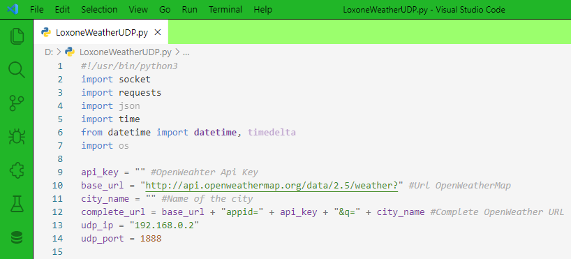

# Sunny Forest
Sunny Forest theme for VS Code. Great mix of white and green.

   

## Screenshot
Screenshot of a Loxone-Weather-UDP written in Python

If you like this check out [Sunny Forest](https://marketplace.visualstudio.com/items?itemName=wolfror.sunny-forest)

## Changelog
You can take a look at the change log [here](https://github.com/WolfRorDev/sunny-forest/blob/master/CHANGELOG.md)